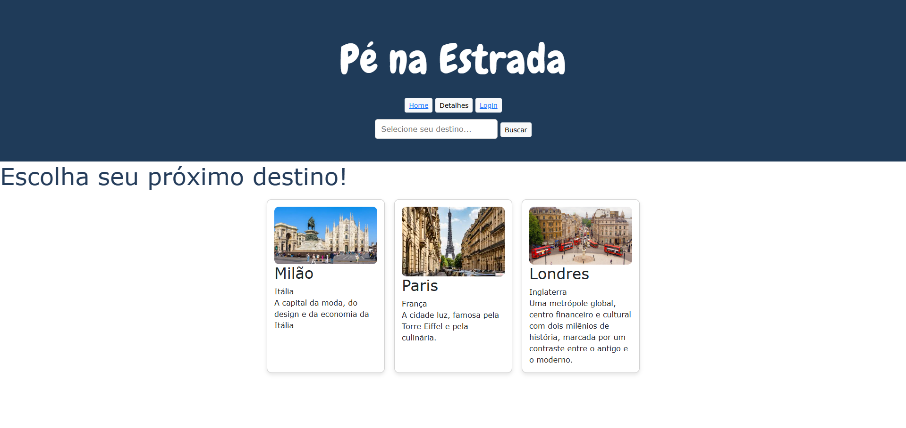

# Trabalho Prático 05 - Semanas 7 e 8

**Páginas de detalhes dinâmicas**

Nessa etapa, vamos evoluir o trabalho anterior, acrescentando a página de detalhes, conforme o  projeto escolhido. Imagine que a página principal (home-page) mostre um visão dos vários itens que existem no seu site. Ao clicar em um item, você é direcionado pra a página de detalhes. A página de detalhe vai mostrar todas as informações sobre o item do seu projeto. seja esse item uma notícia, filme, receita, lugar turístico ou evento.

Leia o enunciado completo no Canvas. 

**IMPORTANTE:** Assim como informado anteriormente, capriche na etapa pois você vai precisar dessa parte para as próximas semanas. 

**IMPORTANTE:** Você deve trabalhar e alterar apenas arquivos dentro da pasta **`public`,** mantendo os arquivos **`index.html`**, **`styles.css`** e **`app.js`** com estes nomes, conforme enunciado. Deixe todos os demais arquivos e pastas desse repositório inalterados. **PRESTE MUITA ATENÇÃO NISSO.**

## Informações Gerais

- Nome: Vinicius Matos 
- Matricula: 898073
- Proposta de projeto escolhida: Lugares e Experiências
- Breve descrição sobre seu projeto: Um site onde as pessoas podem pesquisar seus destinos e com isso saber todos os pontos turísticos, restaurantes famosos , atrações, etc... Como se fosse um mapa.


## Print da Home-Page 


## Print da página de detalhes do item




## Cole aqui abaixo a estrutura JSON utilizada no app.js

```javascript
const dados = [
 const destinos = [
    {
        nome: "Milão",
        pais: "Itália",
        imagem: "images/cards/milao.webp",
        descricao: "A capital da moda, do design e da economia da Itália",
    },

    {
        nome: "Paris",
        pais: "França",
        descricao: "A cidade luz, famosa pela Torre Eiffel e pela culinária.",
        imagem: "images/cards/paris.jpg",
    },

    {
        nome:"Londres",
        pais: "Inglaterra",
        descricao : "Uma metrópole global, centro financeiro e cultural com dois milênios de história, marcada por um contraste entre o antigo e o moderno.",
        imagem: "images/cards/londres.jpg",
    }
    
]
```